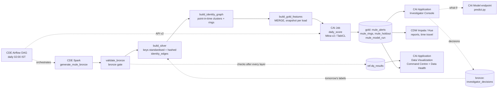

# Mule Account Identifier

Every active account is scored daily for the chance of being a **mule
account** (used to receive and forward the proceeds of fraud), ranked and
tiered for an investigator, with plain-language reasons, ring evidence and a
recommended preventive action (debit freeze pending re-KYC, hold + enhanced
monitoring, watchlist). The model is **Mitra-v2** (GPU) or **TabICL v2**
(CPU), tabular foundation models that learn in context from labelled history
in a gold Iceberg table: no training step, no retraining cycle.

> Demo of a governed data + scoring pipeline on synthetic data, not a
> validated fraud model. It ranks accounts for human review; it never
> freezes one on its own — every tier is a recommended action that goes
> through the investigator console's maker-checker decision flow.

## Architecture



| Layer | Cloudera service | Code |
|---|---|---|
| Ingest + medallion | CDE Spark, Iceberg | `cde/jobs/` |
| Entity resolution | CDE Spark | `cde/jobs/build_identity_graph.py` |
| Orchestration | CDE Airflow | `cde/dags/mule_dag.py`, `cde/scripts/deploy_dag.sh` |
| Scoring + KPI gate | CAI Job | `cai/jobs/daily_score.py`, `backfill_history.py` |
| Experiment tracking | CAI Experiments (MLflow) | logged from `daily_score.py`, experiment `mule-account-identifier` |
| On-demand / what-if | CAI Model Deployment | `cai/model/predict.py` |
| SQL + reports | CDW Impala (Hue) | `sql/reports.sql` |
| Investigator console | CAI Application (Streamlit) | `app/` |
| CI | GitHub Actions | `.github/workflows/ci.yml` |

Databases: `rsingh_mule_acct_{bronze,silver,gold,ref}` (prefix in
`config/mule.yaml`, `--db-prefix` / `DB_PREFIX` on the CDE side).

| Table | Written by | Grain |
|---|---|---|
| `bronze.{kyc_onboarding, cbs_accounts, upi_transactions, digital_sessions, fraud_reports}` | CDE generate | the five source extracts |
| `bronze.investigator_decisions` | CAI app | account × decision: CONFIRMED_MULE / FALSE_POSITIVE / NEEDS_MORE_INFO, maker, checker |
| `ref.{branch_map, product_map, bank_devices}` | CDE generate | branch / product lookups; the bank's own kiosks and BC-agent terminals (never edges) |
| `silver.{customer, account, txn, session, report}` | CDE silver | deduplicated entities, keys standardised + salted SHA-256 |
| `silver.identity_edges` | CDE silver | CIF pair sharing a non-hub device / mobile / PAN hash / address hash, with `first_seen` |
| `silver.graph_edges` | CDE identity graph | snapshot × CIF pair × link type (identity or money-flow), for the app's ring view |
| `silver.identity_clusters` | CDE identity graph | snapshot × CIF: `person_cluster_id`, `ring_id`, sizes |
| `gold.mule_features` | CDE gold (MERGE) | account × weekly snapshot: 18 features + 90-day label |
| `gold.mule_alerts` | CAI job | run date × alerted account: score, tier, action, reason codes |
| `gold.mule_rings` | CAI job | run date × ring: size, top tier, alert counts |
| `gold.mule_holdout` | CAI job | run date × risk band: capture, precision, vs. the rules-only baseline |
| `gold.mule_model_run` | CAI job | run date: model, context window, gold snapshot id, holdout + gate result |

## Method (`config/policy.yaml`)

- **Label** `is_mule_90d` = 1 if the account is confirmed as a mule within 90
  days after the snapshot (fraud report followed by a freeze, Suspect
  Registry match, or an investigator `CONFIRMED_MULE`); an investigator
  `FALSE_POSITIVE` sets it to 0. NULL until 90 days have passed.
- **Snapshots**: every Friday from 2 May 2025 plus the as-of date (today's book).
- **Features (18)**: account profile (age, min-KYC, dormant reactivated),
  money movement (inflow ÷ declared income, distinct senders / receivers 7d,
  pass-through ratio 7d, median hold hours, night share, round-amount share),
  digital (new device logins, VPA / mobile changes), identity graph (accounts
  on the same device, CIFs sharing a mobile, person cluster size, ring size),
  network proximity (hops to a known mule, credits from 1930 / NCRP
  complainants in 30d, only reports known on the snapshot date).
- **Context**: every labelled mule in the last 26 weeks (up to 2,000 on a GPU,
  a quarter of that on CPU) plus 3× as many non-mules; a Bayes prior
  correction maps the model's probability back to the book's measured mule
  rate (`mule/calibrate.py`), so ranking is unchanged but the number an
  investigator reads is calibrated.
- **Gate** (the workshop's "accuracy lies" lesson): at well under 0.1% mule
  rate, a model that flags nobody is over 99.9% "accurate", so the gate reads
  capture at the top 1%, precision at the top 0.2% (the T1 queue), and lift
  over a rules-only baseline (shared device + pass-through + distance to a
  reported account) instead. A failing gate does not stop the run: the model
  run and holdout are still recorded (`gate_passed = false`), yesterday's
  alert queue stays live, and the job exits non-zero.
- **Tiers** by percentile of the calibrated probability across the whole
  scored book: **T1** freeze review (top 0.2%), **T2** hold + monitor (to
  1%), **T3** watchlist (to 3%). A single-account endpoint request has no
  book to rank against, so it uses the `p_mule_adj` cut-offs the latest daily
  run recorded instead.
- **Reason codes**: business rules on the inputs (`mule/reasons.py`), not an
  explanation of the score — they tell an investigator where to look first,
  and the same rules, counted, are the rules-only baseline the gate compares
  the model against.

**Real numbers**, local run against the full synthetic book (parquet
backend, TabICL v2 on CPU, 2026-09-25 snapshot, measured book mule rate
0.065%): holdout AUC 1.000, PR-AUC 0.909, **capture at the top 1% = 100%**
(rules alone 54%), **precision at the top 0.2% = 16.7%**, **lift over rules =
1.85×**. All three gate checks pass. Scoring the book: 20,133 active
accounts, 604 alerts (40 T1 / 161 T2 / 403 T3), 164 rings with an alert.

Synthetic data: ~200,000 customers / 260,000 accounts, extracts from April
2025, ~17M UPI transaction legs by September 2026, ~0.8% mule accounts in
rings of 3–25, three mule patterns (recruited dormant, rented min-KYC with a
shared device, synthetic identity with a reused PAN hash / mobile) and
legitimate look-alikes (students, gig workers, small traders, families
sharing a phone). Prefix-stable history. Scale is a flag
(`--customers`), so tests and CI run small.

## Run locally

Python 3.11 and Java 17.

```bash
python3.11 -m venv .venv && .venv/bin/pip install -r requirements-dev.txt
export HF_HOME=$PWD/.hf_cache

# CDE jobs on local Spark + Iceberg, export gold + a few silver tables to data/parquet
.venv/bin/python scripts/run_cde_local.py all --as-of 2026-09-25
.venv/bin/python scripts/run_cde_local.py history            # Iceberg snapshots of gold

# CAI jobs on parquet (drop --stub for Mitra-v2 / TabICL; first run downloads the checkpoint)
.venv/bin/python cai/jobs/daily_score.py --backend parquet --stub
.venv/bin/python cai/jobs/backfill_history.py --weeks 4 --backend parquet --stub
.venv/bin/python cai/model/test_endpoint.py --local --stub    # demo account + a what-if

MULE_STORAGE_BACKEND=parquet .venv/bin/streamlit run app/streamlit_app.py
.venv/bin/pytest -q
```

## CDE

Six Spark jobs (`scripts/run_cde_local.py all` runs them locally in order):
`generate_mule_bronze` → `validate_bronze` (the bronze gate; fails the DAG
on a hard data-quality problem, or on cue with `--inject-bad-data`) →
`build_silver` (dedupe, key standardisation, salted SHA-256, identity edges)
→ `build_identity_graph` (point-in-time connected components, hub
suppression above `--max-hub-cifs`) → `build_gold_features` (18 features,
90-day label, MERGE). `dq_check` (`--layer silver|gold|publish`) gates the
later layers the same way `validate_bronze` (= `--layer bronze`) gates
bronze: every check, pass or fail, is appended to
`rsingh_mule_acct_ref.dq_results`; a critical failure stops the DAG, a
warning is recorded only.

Deploy to the CDE vcluster:

```bash
./cde/scripts/deploy_jobs.sh      # CDE Repository rsingh-mule-acct-pipeline + the six Spark jobs
```

`deploy_jobs.sh` sizes each job for the vcluster's YuniKorn queue (a 4-core /
8 GB driver, executors of 8 cores / 12 GB starting at 4 and scaling to 16 —
see the comments in the script for why: at ~200k customers the generator runs
~120 partitions and the identity-graph job's label propagation shuffles ~10M
`(snapshot, customer)` labels per iteration). After a code change: `git
push`, then `cde repository sync --name rsingh-mule-acct-pipeline` (re-run
`deploy_jobs.sh` only if resources changed).

Orchestrated by `cde/dags/mule_dag.py`: `generate_mule_bronze` →
`validate_bronze` → `build_silver` → `build_identity_graph` → `dq_silver` →
`build_gold_features` → `dq_gold` → two `PythonOperator`s that trigger and
poll CAI jobs over the API v2 (`rsingh-mule-acct-sync-code`, then
`rsingh-mule-acct-daily-score`) → `dq_publish`, scheduled daily at 20:30 UTC
(02:00 IST). The DAG registers paused (`is_paused_upon_creation=True`).
`generate_mule_bronze` and the check tasks take `--as-of`, and the check tasks
`--pipeline-run {{ run_id }}`; silver, graph and gold derive the as-of date
from what's already in the data. Register / update it:

```bash
./cde/scripts/deploy_dag.sh       # CDE job rsingh-mule-acct-orchestration (--type airflow)
```

Needs these CDE Airflow Variables before the CAI steps will run — without
`MULE_CAI_HOST` they're skipped, so the Spark part is testable on its own:
`MULE_CAI_HOST`, `MULE_CAI_PROJECT_ID`, `MULE_CAI_SYNC_JOB_ID`,
`MULE_CAI_JOB_ID`, `MULE_CAI_API_KEY`. `python
cde/scripts/set_airflow_variables.py` sets exactly these (and no other keys)
once the CAI project exists.

To seed a few days of history on a vcluster before Airflow is running:

```bash
./cde/scripts/backfill_drill.sh                 # the last 3 Fridays, then yesterday
python cai/jobs/backfill_history.py --weeks 8   # matching alert queues, from a CAI session
```

## CAI

`python ci/setup_cai.py` (API v2, idempotent; names and sizes in
`ci/cai_jobs.py`) creates project `rsingh-mule-acct` from this GitHub repo,
its jobs, environment, model and application; `docs/DEMO_RUNBOOK.md` has
the order. The sections below describe what it creates. Project environment
variables (inherited by sessions, jobs, models and apps):

| Variable | Value |
|---|---|
| `HF_HOME` | `/home/cdsw/.hf_cache` |
| `MULE_IMPALA_USER` / `MULE_IMPALA_PASSWORD` | workload user / password (LDAP) |
| `MULE_MODEL_HF_MODEL` | only for an air-gapped copy of `autogluon/mitra-classifier-2` |

Session terminal sanity checks:

```bash
git pull
pip3 install -r requirements.txt   # mlflow is pre-installed via mlflow-cml-plugin; not in requirements.txt

python -c "import torch; print('cuda', torch.cuda.is_available())"
python -c "from mule.storage import get_storage; print(get_storage('impala').query( \
  'SELECT COUNT(*) n, MAX(snapshot_date) d FROM rsingh_mule_acct_gold.mule_features'))"

# reads gold via Impala, holdout + KPI gate, scores the book, writes no table
python cai/jobs/daily_score.py --dry-run

# endpoint logic in-process: demo account, then with a new device login + high pass-through
python cai/model/test_endpoint.py --local --context impala
```

**Jobs**: `rsingh-mule-acct-sync-code` (`cai/jobs/sync_code.py`, 2 vCPU /
8 GB: git reset to origin/main, pip install when `requirements.txt`
changes) and `rsingh-mule-acct-daily-score` (`cai/jobs/daily_score.py`,
4 vCPU / 16 GB), arguments empty (a job run ignores them; the DAG passes
`MULE_RUN_DATE` / `MULE_TRIGGERED_BY` through the environment instead),
schedule Manual (Airflow triggers them over the API v2 — see the CDE
section; `python ci/run_cai_job.py <job>` runs one by hand). The job **exits
non-zero when the KPI gate fails**
(`gate_passed = false` in `mule_model_run`; yesterday's alert queue stays
live) so a red run is visible even before Airflow orchestrates it, and it
logs params + KPIs to MLflow in CAI Experiments when `mlflow` is available.
Run it once, then `python cai/jobs/backfill_history.py --weeks 8` from a
session so the app's holdout-trend and lineage tabs have several run dates.

**Model Deployment**: `rsingh-mule-acct-scorer`, file
`cai/model/predict.py`, function `predict`, 4 vCPU / 16 GB (a GPU profile
if the workspace has one), 1 replica, authentication on. Example input: the output of
`python cai/model/test_endpoint.py --print-request`. Each replica rebuilds
the context of the latest daily run at start-up (same Iceberg snapshot,
window and row count) — **restart** the model after a new daily run to serve
it; a code change needs **Deploy New Build**.

**Application**: `Mule Investigator Console` (subdomain
`rsingh-mule-acct-console`), script `app/run.py`, 2 vCPU / 4 GB (8 GB if
what-ifs score in-app without the endpoint). So what-ifs call the model
endpoint, `setup_cai.py` sets these in the project environment:

| Variable | Where to find it |
|---|---|
| `MULE_ENDPOINT_URL` | model Overview, URL in the sample curl (`https://modelservice.<domain>/model`) |
| `MULE_ENDPOINT_ACCESS_KEY` | model Settings |
| `MULE_ENDPOINT_API_KEY` | User Settings > API Keys, Model API key (authentication is on) |

The Impala credentials come from the project. The console's what-if tab
reports whether it was scored by the endpoint or in-process (the fallback
when the endpoint variables are missing).

Running the demo: `docs/DEMO_RUNBOOK.md` (about 12 minutes, tab by tab,
with a pre-demo checklist).

## CDW

`config/mule.yaml`'s `impala:` section points `mule/storage.py`'s
`ImpalaStorage` at the CDW virtual warehouse (LDAP workload auth over
HTTPS). Every run **`REFRESH`**es `gold.mule_features` before reading it
(CDE commits Iceberg snapshots Impala hasn't seen yet), then pins every read
to that one snapshot id — recorded as `source_snapshot_id` in
`mule_model_run` — so a run never straddles a CDE load mid-write, and the
model endpoint can rebuild the exact same context later with `FOR
SYSTEM_VERSION AS OF`.

Report queries for Hue are checked in at `sql/reports.sql`: alert counts and
top alerts by tier, the weekly book/mule-rate trend, a ring report, the
model-run lineage/trust history, whether a past run's alerts held up against
labels that have since matured, the investigator decisions log, and the
Iceberg time-travel context rebuild (`FOR SYSTEM_VERSION AS OF
<source_snapshot_id>`, values from that run's `mule_model_run` row). Queries 9
to 21 are analytics views: a one-row run briefing, branch and product/KYC
hotspots, reason codes on the freeze queue, mule rate by hops to a known mule
and by pass-through band, the riskiest rings, UPI money forwarded through
alerted accounts, the holdout capture curve against rules, the complaint
trend, days from opening to first report, and Iceberg history.

Two Cloudera Data Visualization dashboards are built as code: the **Mule
Investigation Command Centre** (five sheets: alert queue, rings and network,
trends, model trust, data quality) and **Mule Data Health** (four sheets:
health now, trends, pipeline runs, check details, over
`rsingh_mule_acct_ref.dq_results`). Flat views in `rsingh_mule_acct_report`
(`sql/dataviz_views.sql`), the CAI application from `ci/setup_cai.py
--dataviz`, and `dataviz/build_dashboard.py`, which writes and imports one
export file for both. See [docs/DATAVIZ.md](docs/DATAVIZ.md).

## Layout

```
mule/                shared logic: config, features, model wrappers, calibration,
                      holdout + gate, reasons + tiers, storage, pipeline, scoring, client
cde/jobs/            Spark jobs (generate/validate/silver/graph/gold, dq_check: PySpark + stdlib)
cde/dags/            mule_dag.py (daily Airflow DAG)
cde/scripts/         deploy_jobs.sh, deploy_dag.sh, backfill_drill.sh
cai/jobs/            daily_score.py, backfill_history.py
cai/model/           predict.py (endpoint), test_endpoint.py
app/                 Streamlit Investigator Console + CAI launcher
config/              mule.yaml (names, storage, model), policy.yaml (context, holdout gate, tiers, rules)
scripts/             run_cde_local.py (CDE jobs on a laptop), run_impala_sql.py (a .sql file on CDW)
sql/                 reports.sql (Hue), dataviz_views.sql (dashboard views)
dataviz/             build_dashboard.py, mule_dashboards.json (Data Visualization export, both dashboards)
ci/                  CAI setup over the API v2 (project, jobs, model, apps), run_cai_job.py
docs/                DEMO_RUNBOOK.md, PROJECT_LOG.md, DATAVIZ.md
.github/workflows/   ci.yml (pytest + a small real pipeline run with the gate)
tests/               pytest: generator, CDE contract, mule/ package, headless app render
```

## Sources

- [Mitra on Hugging Face](https://huggingface.co/autogluon/mitra-classifier-2) · [AutoGluon](https://github.com/autogluon/autogluon)
- [TabICL on Hugging Face](https://huggingface.co/jingang/TabICL) · [TabICL (GitHub)](https://github.com/soda-inria/tabicl)
- [RBI: mule accounts and the 1930 cyber-fraud helpline](https://www.rbi.org.in/)
- [Cloudera AI: creating and deploying a model](https://docs.cloudera.com/machine-learning/cloud/models/index.html)
