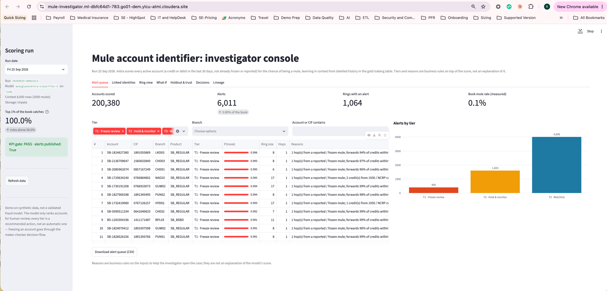

# Demo runbook

Two parts: **Setup** (what was run to get this live on the federal
environment, 2026-09-29) and **Demo** (the ~12-minute walkthrough). IDs and
measured numbers are the real ones; secrets (`MULE_IMPALA_PASSWORD`, API keys)
are never written out. They live in the gitignored `.env`, the CAI project
environment and the Airflow Variables. Details and timings:
`docs/PROJECT_LOG.md`.

## Setup

Everything runs from a laptop with the `cde` CLI configured for the vcluster
and `.env` filled in from `.env.example`:

```bash
set -a; source .env; set +a      # MULE_IMPALA_USER/_PASSWORD, MULE_CAI_HOST, MULE_CAI_API_KEY
```

### 1. CDE: repository, python-env, five Spark jobs

```bash
./cde/scripts/deploy_jobs.sh
```

Repository `rsingh-mule-acct-pipeline`, python-env `rsingh-mule-acct-python-env`,
jobs `rsingh-mule-acct-{generate-bronze,validate-bronze,build-silver,
build-identity-graph,build-gold-features}`. Executors are 4 cores / 8 GB,
2 initial, up to 16: the go01 size (4 initial of 8 cores / 12 GB) failed
within 30 s on the shared federal vcluster, with no logs.

### 2. CAI: project, jobs, environment

```bash
python ci/setup_cai.py --skip-serving --dry-run
python ci/setup_cai.py --skip-serving
python ci/run_cai_job.py rsingh-mule-acct-sync-code
```

Creates project `rsingh-mule-acct` (`fizl-vpsd-g4je-vch4`) from the GitHub
repo, jobs `rsingh-mule-acct-sync-code` (`k18a-gx0s-wurr-ss0j`, 2 vCPU / 8 GB)
and `rsingh-mule-acct-daily-score` (`f9pk-yhdd-c6hs-905f`, 4 vCPU / 16 GB;
8 / 32 never left "scheduling"), and the project environment (`HF_HOME`,
`MULE_IMPALA_USER`, `MULE_IMPALA_PASSWORD`). The first sync-code run is the
one-time pip install (682 s).

### 3. First data chain (as_of 2026-09-28)

Run the five Spark jobs in order (`--as-of 2026-09-28` on generate-bronze;
the others read it from the data), one at a time and not on top of another
project's heavy run, and check each layer in Impala. `cde job run --wait` can
return while a run is still "starting": poll `cde run describe`. Then score:

```bash
python ci/run_cai_job.py rsingh-mule-acct-daily-score --env MULE_RUN_DATE=2026-09-28
```

Real result (TabICL on CPU, 1,273 s): 201,404 accounts scored, holdout AUC
0.9996, capture top 1% 100% (rules alone 58%), precision top 0.2% 25.6%,
lift 1.73x, gate PASS; 402 T1 / 1,612 T2 / 4,028 T3 alerts, 1,002 rings.

### 4. Model and application

They serve the latest published run, so they come after step 3:

```bash
MULE_ENDPOINT_API_KEY="$MULE_CAI_API_KEY" python ci/setup_cai.py
```

Model `rsingh-mule-acct-scorer` (4 vCPU / 16 GB, authentication on) builds
and deploys itself (built in ~9 min, deployed ~12 min after creation);
`MULE_ENDPOINT_URL` / `_ACCESS_KEY` / `_API_KEY` go into the project
environment; then the application `Mule Investigator Console` (subdomain
`rsingh-mule-acct-console`, 2 vCPU / 4 GB). Check the endpoint with
`MULE_ENDPOINT_*` exported (about 14 s per call on CPU):

```bash
python cai/model/test_endpoint.py
```

`MULE_ENDPOINT_API_KEY` is the CAI API v2 key for now; a Model API key
(User Settings > API Keys) would be narrower.

### 5. Airflow Variables and the DAG

```bash
python cde/scripts/set_airflow_variables.py --dry-run
python cde/scripts/set_airflow_variables.py
./cde/scripts/deploy_dag.sh
```

Sets only `MULE_CAI_{HOST,PROJECT_ID,SYNC_JOB_ID,JOB_ID,API_KEY}` (Knox
token for the workload user), then registers `rsingh-mule-acct-orchestration`.
The DAG registers **paused** (`is_paused_upon_creation=True`; `cde job create
--schedule-paused` is rejected for Airflow jobs). Unpausing runs the latest
closed interval at once (as_of the day before its end), then daily at
20:30 UTC / 02:00 IST:

```bash
cde job schedule unpause --name rsingh-mule-acct-orchestration
```

Seven tasks: the five Spark jobs, `cai_sync_code`, `cai_daily_score`.

## Before the demo (60 minutes ahead)

- CDE Job Runs / Airflow UI: today's 02:00 IST DAG run succeeded (all seven
  tasks green, including `validate_bronze`).
- App Lineage tab: today's run with `triggered_by = airflow`, plus earlier
  run dates if backfilled (`cai/jobs/backfill_history.py --weeks 8`).
- Model `rsingh-mule-acct-scorer` restarted after today's run; a test call
  shows today's `run_id`.
- Open the app and run one Hue query 5 minutes before: the Impala virtual
  warehouse auto-suspends and the first query after a pause can take
  minutes.
- Hue open on `sql/reports.sql`; the Airflow UI open on the DAG grid.
- Showing CDE live? Trigger the DAG about 60 minutes before: on federal the
  Spark chain took about 16 minutes and CPU scoring about 21.

## 1. The question (1 min)

Fraudsters recruit or rent bank accounts to receive and forward stolen money
before a victim's complaint catches up. At well under 0.1% of the book, an
investigation team can't review every account — which ones get a debit
freeze today, which get held and watched, and which just go on a watchlist?

## 2. The pipeline (2 min): CDE Airflow UI

- DAG `mule_account_identifier_pipeline`, daily: KYC / core banking / UPI /
  digital session / fraud-report extracts → `validate_bronze` (the hard
  gate: null keys, orphans, a raw PAN outside its governed column, missing
  days) → silver (dedupe, salted-hash keys, identity edges) → identity
  graph (point-in-time person clusters and money-flow rings, hub
  identifiers like branch kiosks excluded) → gold features (Iceberg MERGE)
  → CAI scoring job (triggered over the API v2, polled to completion).
- A `validate_bronze` failure stops the DAG before silver: yesterday's
  alert queue stands, nothing bad reaches an investigator.
- The gold table has one row per active account per weekly snapshot, 18
  numeric features, and the label "confirmed mule within 90 days" fills in
  as it matures: each load is one Iceberg snapshot.

## 3. Alert queue (2 min): app, first tab



- Accounts scored, alert count and share of the book, rings with an alert,
  the measured book mule rate (federal run, 2026-09-28 snapshot, TabICL on
  CPU: **201,404 accounts scored, 6,042 alerts — 402 T1 / 1,612 T2 / 4,028
  T3 — across 1,002 rings, book mule rate 0.065%**; the screenshot is the
  go01 run). "Alerts by tier" bar chart and a filterable, rank-ordered queue.
- Point at the reasons column ("2 hop(s) from a reported mule; minimum-KYC
  (OTP) account"): business rules on the inputs, what the investigator
  opens the case with — not an explanation of the model's score.

## 4. Linked identities and ring view (2 min): app, next two tabs

- Pick a T1 account in Linked identities: the graph shows every other
  customer sharing a non-hub device, mobile, PAN hash or address hash, with
  whether they're alerted this run too.
- Switch to Ring view for the same account's ring: identity links plus
  own-bank money-flow edges (transfers, shared counterparties), point in
  time as of this run's snapshot. This is the evidence behind "ring of
  3-25 accounts" in the synthetic design — a rented min-KYC account usually
  sits one hop from an already-frozen one.

## 5. Can we trust it? (2 min): Holdout & trust tab

- The talking point: "the top 1% of the book catches X% of the mules that
  actually matured, against rules alone" (federal run: **100% capture at the
  top 1%, vs. 58% for rules alone — a 1.73× lift**; precision at the T1
  queue (top 0.2%) is 25.6%, holdout AUC 0.9996).
- Why the gate reads capture/precision/lift instead of accuracy: at well
  under 0.1% mule rate, a model that flags nobody is "99.9% accurate."
- The holdout is honest: context ends 90 days before the test weeks, as if
  the model had been deployed then.

## 6. Live what-if (2 min): What-if tab

- Pick an account near the T2/T1 boundary. Score it as is, then simulate a
  new device login, a mobile/VPA change, and pass-through jumping to 92%:
  `p_mule_adj` typically moves by well over an order of magnitude live,
  scored by the CAI model endpoint (or in-app if the endpoint isn't
  configured — the tab says which). **Whether it crosses into a higher
  tier depends on that day's cut-offs** (Mitra's scoring has some run-to-run
  variability, and cut-offs are recomputed fresh from each day's book) — the
  probability jump is the reliable part of the story, an exact tier flip is
  not guaranteed on every single run.
- Mitra-v2 / TabICL have no training step: `fit` stores the labelled
  context and learning happens at prediction time. Restarting the model
  after a new daily run is how it picks up fresh context, not a retraining
  job.

## 7. Close the loop (1 min): Decisions tab

- Record `CONFIRMED_MULE` (or `FALSE_POSITIVE`) with a checker and a note.
  It's maker-checker: nothing here freezes an account by itself. It lands
  in `bronze.investigator_decisions`; tomorrow's silver load turns a
  `CONFIRMED_MULE` into a label (and a known mule for the graph) with no
  retraining cycle.

## 8. Audit and time travel (1 min): Lineage tab + Hue

- Lineage table: model family/checkpoint, context window, and the Iceberg
  snapshot id of gold each run read.
- In Hue: `DESCRIBE HISTORY` on `mule_features`, then query 8 in
  `sql/reports.sql` with `FOR SYSTEM_VERSION AS OF <source_snapshot_id>` to
  rebuild the exact context a past run learned from. Query 6 checks whether
  a past run's alerts held up against labels that have since matured.

## Honest framing (close)

Synthetic data, demo pipeline, not a validated fraud model. It ranks
accounts for human review; it never freezes one on its own — every tier is
a recommended action that goes through the maker-checker decision flow. The
context holds account and identity rows, so it stays inside the governed
project with the same masking policies as the gold table.
